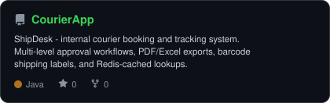

<div align="center">

<!-- No portrait yet - add one with:
       python scripts/dotify.py your-photo.jpg -o assets/portrait \
         --cols 100 --equalize --detail 0.5 --color
     then drop an  back in above the banner. -->

<!-- NAME / TAGLINE - animated typing -->
<a href="https://github.com/naveenkumarvaradha">
  
</a>

<br>

<!-- SOCIALS - fill in the ones you have, drop the rest -->
<a href="https://www.linkedin.com/in/naveenkumarvaradharaj/"></a>
<a href="mailto:naveenkumarvaradha@gmail.com"></a>
<a href="https://naveenkumarvaradha.github.io/"></a>
<a href="https://naveenkumarvaradha.github.io/resume.html"></a>


</div>

---

## `~/` whoami

```console
$ cat about.txt
```

Hi, I'm **Naveenkumar Varadharaj**, a **Full-Stack Developer**. I build backend systems and
full-stack apps - Java and Spring Boot on the server, React and TypeScript on the client -
and I go deep on security engineering when a project calls for it.

- Currently building **[CourierApp](https://github.com/naveenkumarvaradha/CourierApp)** - a courier booking and tracking system, **PDFEditor** - a full-stack PDF editor with digital signatures and OCR (source private), and **NaVault** - an offline Android password/document vault (Rust + Java, source private, [APK available — v0.2.0](https://github.com/naveenkumarvaradha/naveenkumarvaradha.github.io/releases/tag/navault-v0.2.0))
- Portfolio: **[naveenkumarvaradha.github.io](https://naveenkumarvaradha.github.io/)** · Resume: **[resume.html](https://naveenkumarvaradha.github.io/resume.html)**
- Also 3+ years of professional experience automating ERP workflows (Datatex, WFX) for a textile manufacturer - bridging business process and system configuration
- Fun fact: **I configure ERP workflows by day and write Spring Boot / React apps by night**

<br>

<div align="center">

## `~/` toolbox


</div>

---

<div align="center">

## `~/` skill radar

<table>
<tr>
<td width="50%" align="center" valign="middle">

<!-- Self-rated radar - edit assets/skills.json, the workflow redraws it -->
<picture>
  <source media="(prefers-color-scheme: dark)"  srcset="assets/radar-dark.svg">
  <source media="(prefers-color-scheme: light)" srcset="assets/radar-light.svg">
  
</picture>

</td>
<td width="50%" align="center" valign="middle">

<!-- Live radar built from real language byte counts across your repos -->
<picture>
  <source media="(prefers-color-scheme: dark)"  srcset="assets/radar-langs-dark.svg">
  <source media="(prefers-color-scheme: light)" srcset="assets/radar-langs-light.svg">
  
</picture>

</td>
</tr>
</table>

</div>

---

<div align="center">

## `~/` contribution calendar

<!-- 3D isometric calendar, regenerated every 6h by .github/workflows/metrics.yml -->


<br><br>

<!-- Snake eats the contribution graph - .github/workflows/snake.yml -->
<picture>
  <source media="(prefers-color-scheme: dark)"  srcset="https://raw.githubusercontent.com/naveenkumarvaradha/naveenkumarvaradha/output/snake-dark.svg">
  <source media="(prefers-color-scheme: light)" srcset="https://raw.githubusercontent.com/naveenkumarvaradha/naveenkumarvaradha/output/snake.svg">
  
</picture>

</div>

---

<div align="center">

## `~/` the numbers

<!-- Generated by scripts/cards.py into this repo. Deliberately NOT
     github-readme-stats / streak-stats / github-profile-trophy: those are
     shared public instances that go down and take the whole section with them. -->
<picture>
  <source media="(prefers-color-scheme: dark)"  srcset="assets/card-stats-dark.svg">
  <source media="(prefers-color-scheme: light)" srcset="assets/card-stats-light.svg">
  
</picture>

<br>


<br><br>


</div>

---

<div align="center">

## `~/` selected work

<!-- Card generated by scripts/cards.py from assets/projects.json.
     Stars, forks and language are pulled live from the API on every run.
     Add more entries to assets/projects.json as you ship more repos. -->
<a href="https://github.com/naveenkumarvaradha/CourierApp">
  <picture>
    <source media="(prefers-color-scheme: dark)"  srcset="assets/card-CourierApp-dark.svg">
    <source media="(prefers-color-scheme: light)" srcset="assets/card-CourierApp-light.svg">
    
  </picture>
</a>

<sub>

| project | stack |
|---|---|
| **[CourierApp](https://github.com/naveenkumarvaradha/CourierApp)** | `Java` `Spring Boot` `React` `TypeScript` `PostgreSQL` `Redis` |
| **NaVault** — source private, [APK download — v0.2.0](https://github.com/naveenkumarvaradha/naveenkumarvaradha.github.io/releases/tag/navault-v0.2.0) | `Rust` `Java` `Android` `AES-256-GCM` `SQLite` |
| **PDFEditor** — full-stack, Acrobat-level PDF editor (source private) | `Java` `Spring Boot` `PDFBox` `BouncyCastle` `React` `TypeScript` |

</sub>

<!-- NaVault and PDFEditor have no generated card above: cards.py pulls repos from
     GET /users/{user}/repos, which the GitHub API only ever returns PUBLIC
     repos through, token or not. A private repo can't get a real card from
     that pipeline, hence the plain table row instead of a project.json entry. -->

</div>

---

<div align="center">

<sub>`01101110 01100001 01110110 01100101 01100101 01101110`</sub>

</div>
